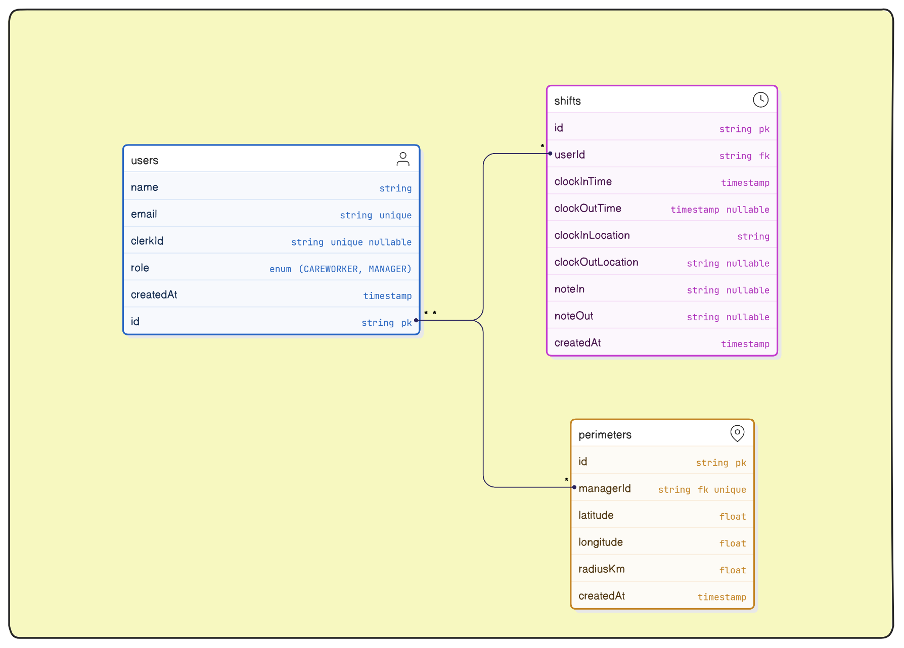
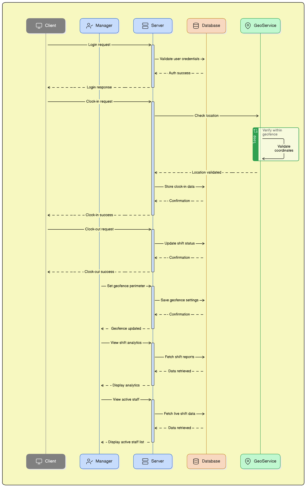
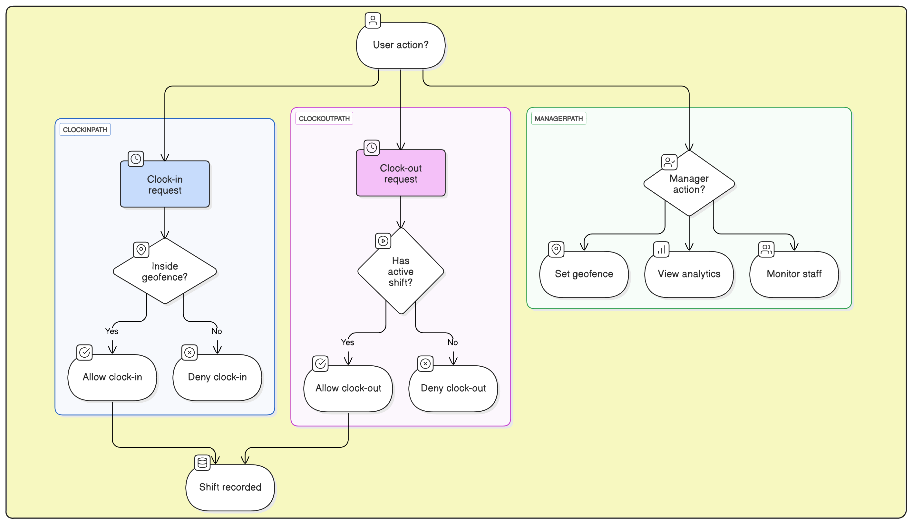

# 🌍 GeoShift - Healthcare Shift Clock-in App

GeoShift is a **web application** that enables **healthcare workers** to **clock in and out** of their shifts based on **geolocation tracking**. It provides **real-time shift monitoring**, **geofencing enforcement**, and an **admin dashboard** for managers.

## ER Diagram

## Sequence Diagram

## Flow Chart

## 🚀 Features

### **🔹 Care Workers**

✅ **Clock-in** only when inside the hospital's geofenced area.  
✅ **Clock-out** at the end of the shift.  
✅ **Add shift notes** while clocking in/out.  
✅ **View shift history** with timestamps & locations.

### **🔹 Managers**

✅ **Set geofence perimeters** (e.g., 2km around a hospital).  
✅ **Monitor live shifts** (who is clocked in & their location).  
✅ **View analytics** (total hours worked, shifts per day).

---
